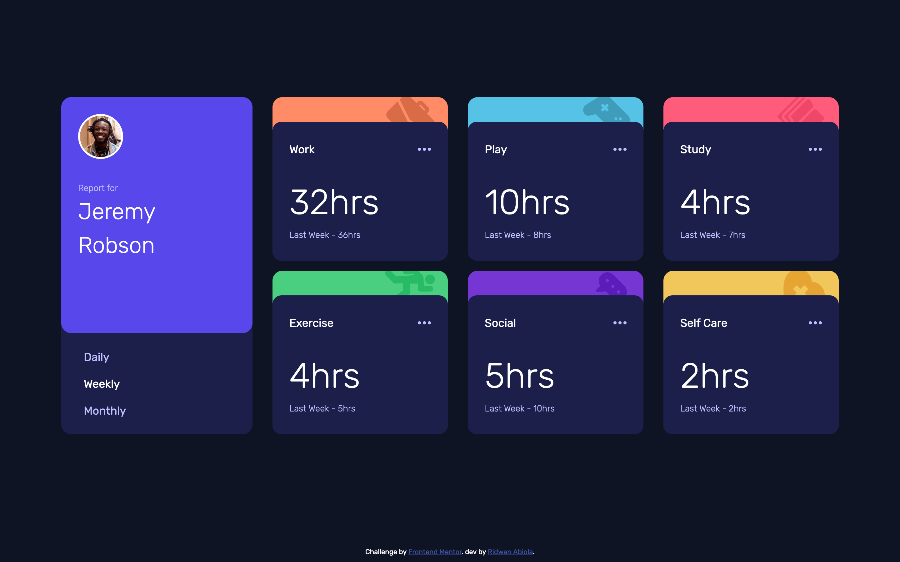
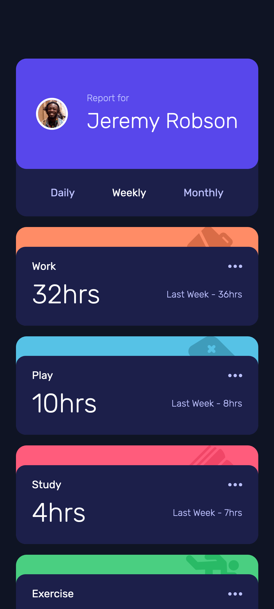

# Frontend Mentor - Time tracking dashboard solution

A personal solution to [Time tracking dashboard challenge on Frontend Mentor](https://www.frontendmentor.io/challenges/time-tracking-dashboard-UIQ7167Jw). Frontend Mentor challenges help you improve your coding skills by building realistic projects.

## Table of contents

- [Overview](#overview)
  - [The challenge](#the-challenge)
  - [Screenshot](#screenshot)
  - [Links](#links)
- [My process](#my-process)
  - [Built with](#built-with)
- [Author](#author)
- [Acknowledgments](#acknowledgments)

## Overview

Stat cards are the main focus of a Time Tracking UI. Curved border radius gives a modern feel to the page. Subtle animation to also enhance overall UX.

### The challenge

Users should be able to:

- View the optimal layout for the site depending on their device's screen size
- See hover states for all interactive elements on the page
- Switch between viewing Daily, Weekly, and Monthly stats

### Screenshot

### Links

- Solution URL: [FM Solution](https://www.frontendmentor.io/challenges/time-tracking-dashboard-UIQ7167Jw/hub/mobile-first-time-tracking-ui-mbNPL8jV5)
- Live Site URL: [Time Tracking UI: (github pages)](https://abu-hasib.github.io/time-tracking-ui/)
- Live Site URL: [Time Tracking UI: (vercel)](https://time-tracking-ui.vercel.app/)

## My process

I went with the vanilla way. Even though it took longer but it was worth it. I got to play around with different way doing things.

I followed these steps but still overlapped as time went by.

    Fleshed out the html
    Wrote the styles
    Added interactivity

### Built with

- Semantic HTML5 markup
- CSS custom properties
- Flexbox
- CSS Grid

## Author

- Website - [Ridwan](https://ridwanabiola.netlify.app/)
- Frontend Mentor - [@abu-hasib](https://www.frontendmentor.io/profile/abu-hasib)

## Acknowledgments

Stack Overflow
